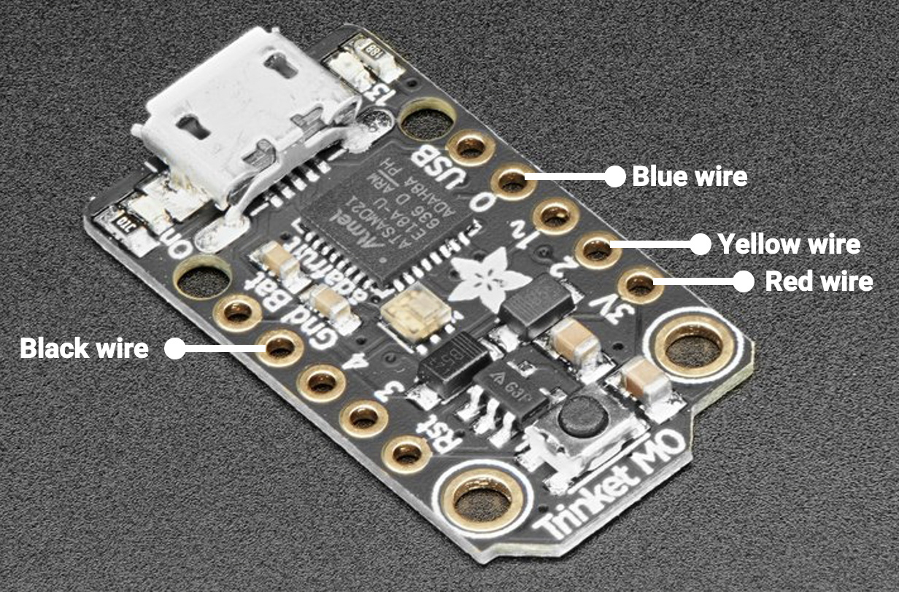
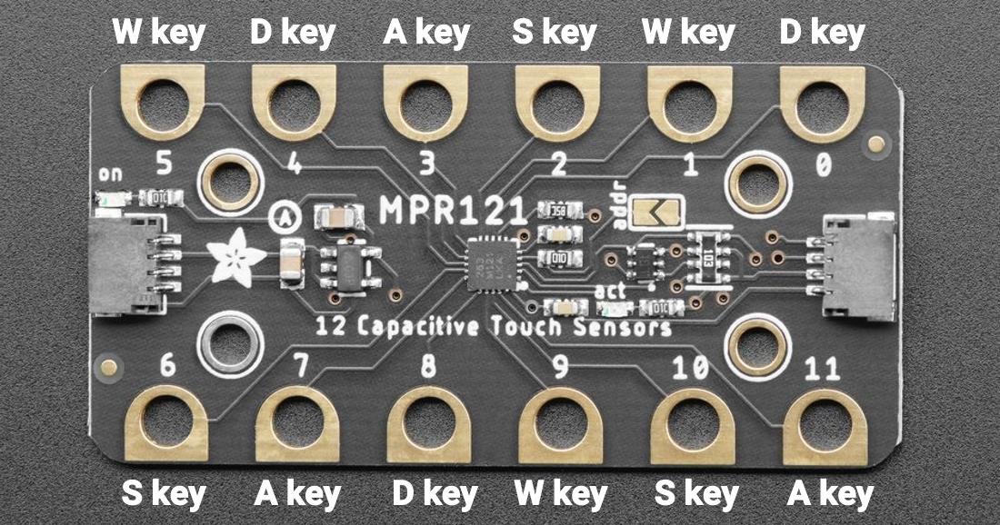

# SMRL Outreach Capacitive Touch Sleeve - Deployment Guide

## Project Description
This repo summarizes all the steps you will need for the outreach project. The repo contains two folders:
- **Update CircuitPy version to 7.3.0** contains the CircuitPython 'OS' (a .UF2 file)
- **Replace CircuitPy lib and main with contents** contains the code (a 'lib' folder and a 'main.py' file) to verify your hardware is working

## Updating the CircuitPython version on your Trinket M0:
1. Hook your Trinket M0 up to a computer with a known-good USB data cable, and double-tap the button on the end to bring up the bootloader (you'll see files with .UF2 extensions).
2. Navigate up one level, until you see the TRINKETBOOT icon.
3. Drag the .UF2 file out of the "Update CircuitPy version..." folder onto TRINKETBOOT.	The Trinket will restart, loading the new version.
4. You can find the most updated version of CircuitPython here: https://learn.adafruit.com/adafruit-trinket-m0-circuitpython-arduino?view=all#circuitpython

## Loading code onto your Trinket M0:
1. Once the Trinket has reset, delete the code.py file from the CIRCUITPY folder.
2. Copy the 'lib' folder and main.py file from the "Replace CircuitPy lib..." folder into the CIRCUITPY folder (This will look like a USB drive, and may open automatically when the board resets).

## Plug in the capacitive touch sensor (MPR121):
1. Insert a Stemma QT four-wire connector into the MPR121 at either end.
2. Plug the black jumper wire onto the GND pin on the Trinket, see image below.
3. Plug the red jumper wire onto the 3V pin on the Trinket.
4. Plug the blue jumper wire on to the 0 pin on the Trinket. This is the SDA pin for the I2C communication bus.
5. Plug the yellow jumper wire onto the 2 pin on the Trinket. This is the SCL pin for the I2C communication bus.

  

## Verify your code is working:
1. Place the cursor of your computer into a text field and touch the pads on the MPR121. Variations on the letters 'W', 'A', 'S', and 'D' should appear in the text field. You may customize these in the Keys_Pressed list in 'main.py' file (see lines 24 to 37).

## Demonstration: Creating a human computer interface device with capacitive touch buttons:
1. Connect the conductive nylon fabric tape (3961, Adafruit) to the pins on the capacitive touch sensor. The WASD key map is shown below.
2. To verify the device is working, place the cursor of your computer into a text field and touch the pads on the MPR121 or conductive nylon fabric tape. The letters 'W', 'A', 'S', and 'D' should appear in the text field based on the pin you are touching. You may customize these in the Keys_Pressed list in 'main.py' file using a text editor such as Atom, Notepad++, or Sublime Text.
3. When a pad is touched it can also be used to output a digital signal. Currently when pad 8 is touched the built-in red LED (pin 13) will turn on. When pad 11 is touched the built-in red LED (pin 13) will turn off. Three pins on the Trinket are available: pin 1 (led1), pin 3 (led3), and pin 4 (led4). You can modify this code starting on line 78 of the main.py file.

  

## Installing the code editor:
1. You can also edit and upload the code using Mu. Installation instructions can be found here: https://learn.adafruit.com/adafruit-trinket-m0-circuitpython-arduino?view=all#installing-mu-editor
2. Mu contains a serial console to allow you to display output text using a "print statement". See line 14 in the main.py file.
3. The other feature of the serial connection is the Read-Evaluate-Print-Loop (REPL): https://learn.adafruit.com/adafruit-trinket-m0-circuitpython-arduino?view=all#the-repl

## License
This project is licensed under the terms of the MIT license.

These steps have been adapted from the following Adafruit tutorials:
- https://learn.adafruit.com/adafruit-trinket-m0-circuitpython-arduino/overview
- https://learn.adafruit.com/adafruit-mpr121-gator

## Authors
- Kasey Moomau, Eric Markvicka, June 2022
