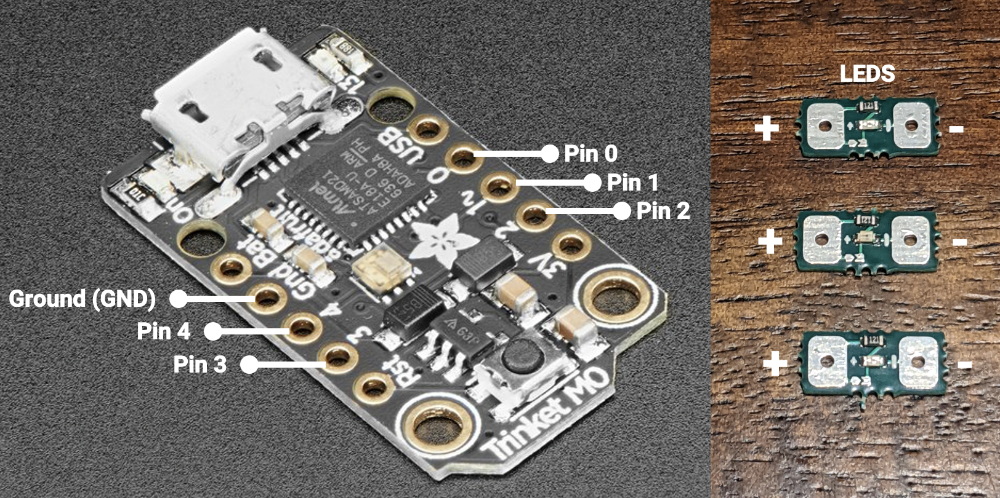

# SMRL Outreach LED Display Sleeve - Deployment Guide

## Project Description
This repo summarizes all the steps you will need for the outreach project. The repo contains two folders:
- **Update CircuitPy version to 7.3.0** contains the CircuitPython 'OS' (a .UF2 file)
- **Replace CircuitPy lib and main with contents** contains the code (a 'main.py' file) to verify your hardware is working

## Updating the CircuitPython version on your Trinket M0:
1. Hook your Trinket M0 up to a computer with a known-good USB data cable, and double-tap the button on the end to bring up the bootloader (you'll see files with .UF2 extensions).
2. Navigate up one level, until you see the TRINKETBOOT icon.
3. Drag the .UF2 file out of the "Update CircuitPy version..." folder onto TRINKETBOOT.	The Trinket will restart, loading the new version.
4. You can find the most updated version of CircuitPython here: https://learn.adafruit.com/adafruit-trinket-m0-circuitpython-arduino?view=all#circuitpython

## Loading code onto your Trinket M0:
1. Once the Trinket has reset, delete the code.py file from the CIRCUITPY folder (This will look like a USB drive, and may open automatically when the board resets).
2. Copy the main.py file from the "Replace CircuitPy lib..." folder into the CIRCUITPY folder. 

## Attach LEDs to Trinket M0:
1. Connect female/male 'extension' jumper wires to the ground pin and digital I/O pins 0, 1, 2, 3, and/or 4 on the Trinket, see image below.
2. Connect the 'GND' side of the LEDs, see image below, to the jumper wire connected to the ground pin on the Trinket using conductive nylon fabric tape (3961, Adafruit).
3. Connect the '+' side of the LEDs, see image below, to the jumper wire connected to the digital I/O pins 0, 1, 2, 3, and/or 4 on the Trinket using conductive nylon fabric tape.
4. Multiple LEDs can be connected to each digital I/O pin in parallel.
5. Modify the LED pattern. See line 36 in the main.py file.
    Additional info: https://learn.adafruit.com/adafruit-trinket-m0-circuitpython-arduino/circuitpython-digital-in-out

  

## Verify your code is working:
1. You can verify that your code is working by using the built-in LED that is attached to pin 13. You can access this LED using board.LED or board.D13.

## Installing the code editor:
1. You can also edit and upload the code using Mu. Installation instructions can be found here: https://learn.adafruit.com/adafruit-trinket-m0-circuitpython-arduino?view=all#installing-mu-editor
2. Mu contains a serial console to allow you to display output text using a "print statement". See line 14 in the main.py file.
3. The other feature of the serial connection is the Read-Evaluate-Print-Loop (REPL): https://learn.adafruit.com/adafruit-trinket-m0-circuitpython-arduino?view=all#the-repl

## License
This project is licensed under the terms of the MIT license.

These steps have been adapted from the following Adafruit tutorials:
- https://learn.adafruit.com/adafruit-trinket-m0-circuitpython-arduino/overview

## Authors
- Kasey Moomau, Eric Markvicka, June 2022
